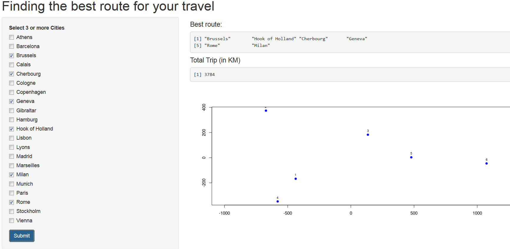

Finding the best route in Eurpoe
========================================================
author: Marlina Kosasih
date: Jan 26, 2016

The Best Route in Eurpoe App
========================================================

This App was created to find the best route when traveling to Europe.

The data is collected from eurodist, part of datasets package in R.

The data give the road distances (in km) between 21 cities in Europe. 
The data are taken from a table in The Cambridge Encyclopaedia

Sample of Data
========================================================


```r
data(eurodist)
df <- as.matrix(eurodist)
df[1:4,1:4]
```

```
          Athens Barcelona Brussels Calais
Athens         0      3313     2963   3175
Barcelona   3313         0     1318   1326
Brussels    2963      1318        0    204
Calais      3175      1326      204      0
```

Plotting 21 cities based on road distance
========================================================


User Input and Output
========================================================
To use this App, users simply required to pick 3 or more cities on
the available checkbox.

Once submitted, the App will generate the best raute and will
provide the total trip in km.


Here is the snapshot of the App
========================================================

